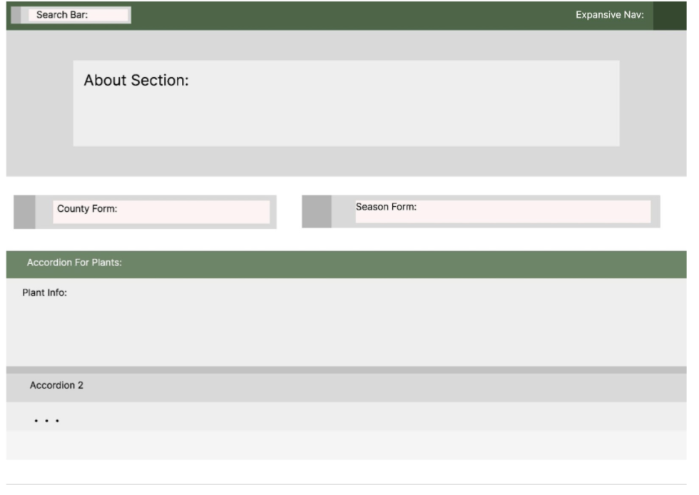

# Grow Zone Tracker (Project #1 - Group #3) 
--------

## Description

Gardening in Arizona requires specific knowledge about which plants thrive in different hardiness zones and at various times of the year. By providing an easy-to-use tool that offers personalized planting recommendations, gardeners can make informed decisions that lead to healthier plants and more bountiful gardens.

## Technologies Used

|        |  | 
| ------------- |:-------------:| 
| HTML          |  | 
| Bootstrap     |  |   
| Custom CSS    |  |   
| Javascript    |  |
| Markdown      |  |
| VS Code       |  |   
| Git           |  |   
| Git Copilot   |  |
| Github        |  |
| Public API    |  |

## Table of Contents: 

1. Title and Project Number  
2. Description  
3. Technologies Used  
4. Table of Contents  
5. User Story  
6. Acceptance Criteria  
7. Installation  
8. Usage  
9. Mockup  
10. Contributors  
11. License  
12. Author Info  
13. Deployed Link  

## User Story

AS A USER in the U.S.A., 
 
 
I WANT a website where I can search for different plants either by their name and/or by hardiness zones and even save them to my favorites, 
 
 
SO THAT I can get personalized planting recommendations on what plants I'm able to grow best in my geaographical location based on my hardiness zone and also see photos and information on the plants.

## Acceptance Criteria

See USERSTORY.md file for Acceptance Criteria. 

## Installation 

N/A

## Usage

To use this website, click on the deployed link at the bottom of this ReadMe file. Then, from the Home page, you can either use the search bar at the top in the navigation section of the website to search for a specific plant or you can use the hardiness zone dropdown menu in the body of the website, located below the navigation menu, to select your hardiness zone and search for plants in that specific zone. 

Any plant that you see on the website, you will notice a checkbox right below it. Click this checkbox if you wish to add that plant to your Favorites. Then when you come back to the website later, simply click on the Favorites button in the navigation menu at the top to see all the plants that you saved to your favorites.

There is also a toggle button at the top in the navigation menu that you can click to switch between day mode and night mode. 

Then if you click on Hardiness Map in the navigation menu, it will take you to another page in the wbsite that shows you which hardiness zone you are in based on your geographical location in the U.S.A. 

Lastly, there is a Learn More page in the website that provides links to more resources about plants.

## Wireframe

## Contributors

* Heather Serrano (magneticsoul7) https://github.com/MagneticSoul7  
* Lauren Coates (Lcoates5) https://github.com/Lcoates5  
* Victor Roman (Romantech91) https://github.com/Romantech91  
* Bjorn Johansson (Bbbjrn) https://github.com/Bbbjrn 

## License

MIT License.

## Author Info

|        |  | 
| ------------- |:-------------:|   
| Github    | https://github.com/Bbbjrn/Group03-Project |   

## Deployed Link 

https://bbbjrn.github.io/Group03-Project/ 
